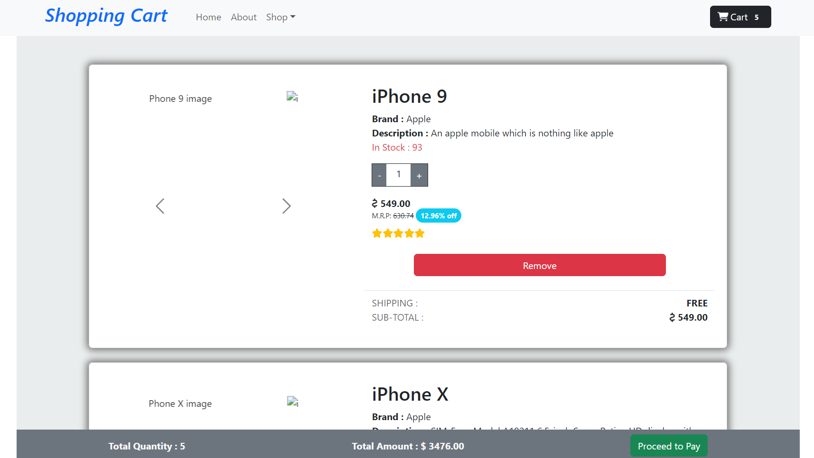

# React Redux Cart Application

This project implements a cart page in React using Redux Toolkit, integrating functionalities to manage per-item quantities, calculate totals dynamically, and update state using Redux.



## Features

- Display per-item price, per-item quantity, total quantity, and total amount.
- Increase or decrease per unit quantity to automatically update total quantity and amount.
- Redux Toolkit for state management.

## Technologies Used

- React
- Redux Toolkit
- JavaScript
- HTML5
- CSS3

## Installation

1. **Clone the Repository**
   ```bash
   git clone https://github.com/Rajkumar-195/Redux-Shopping-Cart
2. **Navigate to the project directory:**
   ```bash
   cd Redux-Shopping-Cart

3. **cd react-shopping-cart:**
   ```bash
   npm install

4. **Start the development server:**
   ```bash
   npm run dev

## Development Process

The project uses Redux Toolkit for efficient state management. Components are structured to handle item quantities dynamically, updating totals in real-time.

## Conclusion

This project demonstrates creating a responsive cart page in React with Redux Toolkit, offering robust functionality for managing item quantities and calculating totals dynamically.

## Contact

For any inquiries or feedback, please contact:
- Name: Rajkumar A
- Email: rajkumaranbu195@gmail.com
- LinkedIn: [Rajkumar A](https://www.linkedin.com/in/rajkumar-info/)
